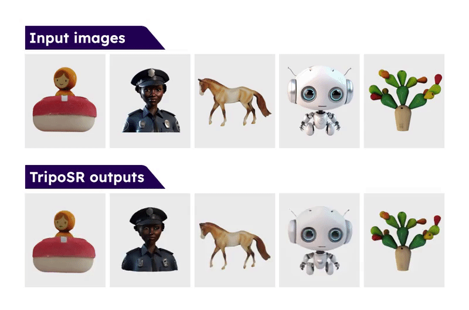
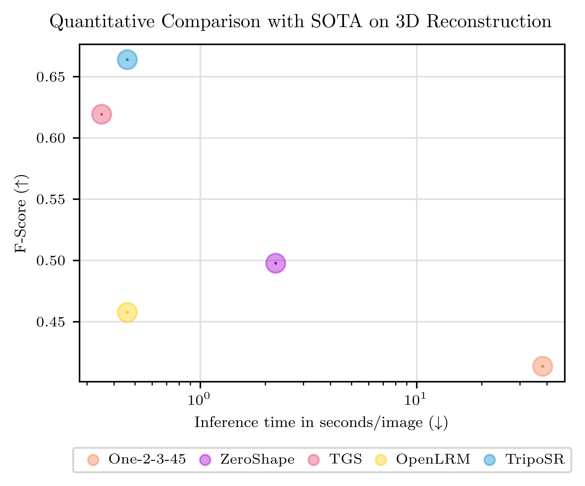

# TripoSR

1. Activate env

```sh
source myenv/bin/activate
```

2. Run CLI

```sh
python run.py examples/chair.png --output-dir images/out/
```

This will save the reconstructed 3D model to `images/out/`. You can also specify more than one image path separated by spaces. The default options takes about **6GB VRAM** for a single image input.

For defailed usage of this script, use `python run.py --help`.

3. OR run Gradio

```sh
python gradio_app.py
```

4. Import into Blender

5. Fix the mesh

The mesh will be a mess. But you can tame it with a few modifiers like

- Remesh
- Triangulate
- Decimate

Another recommendation is to use the Quadriflow Remesh tool as part of the [JRemesh Tools add-on](https://blendermarket.com/products/jremesh-tools).

---

Here comes the official repo README:

<div align="center">
  
</div>

This is the official codebase for **TripoSR**, a state-of-the-art open-source model for **fast** feedforward 3D reconstruction from a single image, collaboratively developed by [Tripo AI](https://www.tripo3d.ai/) and [Stability AI](https://stability.ai/).
<br><br>
Leveraging the principles of the [Large Reconstruction Model (LRM)](https://yiconghong.me/LRM/), TripoSR brings to the table key advancements that significantly boost both the speed and quality of 3D reconstruction. Our model is distinguished by its ability to rapidly process inputs, generating high-quality 3D models in less than 0.5 seconds on an NVIDIA A100 GPU. TripoSR has exhibited superior performance in both qualitative and quantitative evaluations, outperforming other open-source alternatives across multiple public datasets. The figures below illustrate visual comparisons and metrics showcasing TripoSR's performance relative to other leading models. Details about the model architecture, training process, and comparisons can be found in this [technical report](https://drive.google.com/file/d/1LWlZPT2aASi9jHiGVhDSr4YCTANoFW5t/view).

<p align="center">
    
</p>

<p align="center">
    
</p>

The model is released under the MIT license, which includes the source code, pretrained models, and an interactive online demo. Our goal is to empower researchers, developers, and creatives to push the boundaries of what's possible in 3D generative AI and 3D content creation.

## Getting Started

### Installation

- Python >= 3.8
- Install PyTorch according to your platform: [https://pytorch.org/get-started/locally/](https://pytorch.org/get-started/locally/)
- Install other dependencies by `pip install -r requirements.txt`

### Manual Inference

```sh
python run.py examples/chair.png --output-dir output/
```

This will save the reconstructed 3D model to `output/`. You can also specify more than one image path separated by spaces. The default options takes about **6GB VRAM** for a single image input.

For defailed usage of this script, use `python run.py --help`.

### Local Gradio App

Install Gradio:

```sh
pip install gradio
```

Start the Gradio App:

```sh
python gradio_app.py
```

## Citation

```BibTeX
@article{TripoSR2024,
  title={TripoSR: Fast 3D Object Reconstruction from a Single Image},
  author={Tochilkin, Dmitry and Pankratz, David and Liu, Zexiang and Huang, Zixuan and and Letts, Adam and Li, Yangguang and Liang, Ding and Laforte, Christian and Jampani, Varun and Cao, Yan-Pei},
  journal={arXiv preprint arXiv:XXXX.XXXXX},
  year={2024}
}
```
